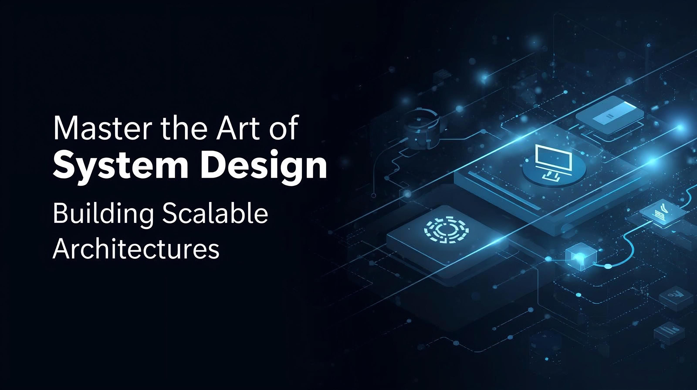

  

# 📘 System Design Mastery (LLD + HLD)

Welcome to the **System Design Mastery Course**!  
This repository is designed to prepare you for **senior software engineering roles**, with a focus on **Low-Level Design (LLD)** and **High-Level Design (HLD)**.

By the end, you will be able to:  
✅ Write clean, extensible, and scalable **object-oriented designs** (LLD)  
✅ Architect large-scale systems like **Netflix, Uber, and Twitter** (HLD)  
✅ Crack **System Design interviews** with confidence  
✅ Apply principles in **real-world projects**

---

## 📂 Repository Structure

- **LLD/** → Learn OOP, design principles, patterns, and case studies
- **HLD/** → Dive into distributed systems, databases, caching, queues, and large-scale architectures
- **Advanced/** → Explore event-driven design, consensus, observability, and APIs
- **Interview_Preparation/** → Frameworks, trade-offs, mock problems, and pitfalls
- **Projects/** → Hands-on capstone projects like social media, chat apps, video streaming, etc.

---

## 🚀 Course Roadmap

### **Low Level Design Prerequisites**
- Event-Driven Architecture
- Distributed Consensus (Paxos, Raft)
- Database Internals (Indexes, Isolation)
- Monitoring & Observability
- API Design Best Practices (REST, gRPC, GraphQL)

### **Low Level Design (LLD)**
- What is System Design & why it matters
- Difference between **LLD vs HLD**
- Principles of scalability, maintainability, performance

### **High Level Design Prerequisites**
- Event-Driven Architecture
- Distributed Consensus (Paxos, Raft)
- Database Internals (Indexes, Isolation)
- Monitoring & Observability
- API Design Best Practices (REST, gRPC, GraphQL)

### **High-Level Design (HLD)**
- Client-Server Model
- Databases (SQL vs NoSQL, partitioning, replication)
- Caching & Load Balancing
- Message Queues (Kafka, RabbitMQ)
- Security (OAuth, JWT, HTTPS)
- Case Studies: URL Shortener, Instagram, YouTube, WhatsApp, E-commerce

---

## 📊 Learning Path
1. Start with **LLD basics**
2. Move to **HLD fundamentals**
3. Solve **case studies**
4. Deep dive into **advanced topics**
5. Practice **mock interview problems**
6. Build **capstone projects**

---

## 📚 Resources

### **Books**
- *Designing Data-Intensive Applications* – Martin Kleppmann
- *System Design Interview* – Alex Xu
- *Head First Design Patterns* – Eric Freeman

### **Websites**
- LeetCode Design Problems
- Grokking the System Design Interview
- Awesome System Design (GitHub curated list)

### **Cheat Sheets**
- CAP Theorem Explained
- Database Indexing & Partitioning
- Common Design Patterns Quick Reference

---

## 🎯 Outcome
By completing this course, you will:
- Think like a **system architect**
- Communicate design ideas clearly with **diagrams & trade-offs**
- Be fully prepared for **Senior Engineer / Architect interviews**

---

🔥 Let’s get started and build systems that scale!
